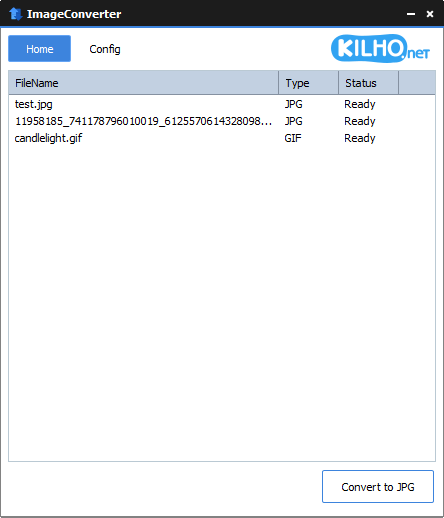

# ImageConverter

**画像ファイルをドラッグしてボタン 1 つで JPG · PNG · GIF · WEBP · TIFF に変換する、Windows 用の無料画像変換ソフト。**

[English](README.md) · [한국어](README.ko.md) · [简体中文](README.zh-CN.md) · 日本語 · [Español](README.es.md) · [Português (Brasil)](README.pt-BR.md) · [Français](README.fr.md)

> この文書は翻訳版です。内容に相違がある場合は[韓国語版](README.ko.md)が正となります。

-0078D4)

## 概要

iPhone で撮った HEIC 写真がパソコンで開けないとき、ブログに載せる写真をまとめて縮小したいとき、PDF をページごとの画像にしたいとき — ImageConverter が片付けます。

ファイルやフォルダをウィンドウにドラッグして **変換** ボタンを押すだけです。JPG は MozJPEG でより小さく保存し、サイズを指定すれば縦横比を保ったまま縮小・拡大します。エクスプローラーでファイルを右クリックしてすぐ変換することもできます。

変換結果は必ず **新しいファイル** として保存されます。元のファイルや既存のファイルを上書きすることはありません。

## 主な機能

- **まとめて変換** — 複数のファイルや、フォルダごと(サブフォルダまで)リストに入れて一度に変換します。
- **5 つの保存形式** — JPG · PNG · GIF · WEBP · TIFF。
- **幅広い入力形式** — JPG、PNG、GIF、BMP、WEBP、TIFF、HEIC、AVIF、PSD、PDF、SVG、TGA、ICO など。
- **より小さな JPG** — MozJPEG で同じ画質をより小さな容量に保存します。
- **縦横比を保ったサイズ変更** — 幅か高さだけ決めれば、もう一方は比率に合わせて決まります。
- **PDF → 画像** — 複数ページの PDF をページごとに 1 枚ずつ画像にします。
- **拡張子がなくても認識** — ファイル名ではなくファイルの中身から形式を判別します。
- **元ファイルを保護** — 同じ名前があれば `photo (1).jpg` のように新しい名前で保存します。
- **エクスプローラーの右クリックメニュー** — Windows 10 · 11 の両方、Windows 11 の標準メニューにも表示されます。
- **7 言語** — 韓国語 · 英語 · 日本語 · 中国語 · ロシア語 · イタリア語 · フランス語。Windows の表示言語に従います。

## ダウンロード / インストール

| 種類 | リンク |
|---|---|
| インストーラー | [ダウンロード](https://down.kilho.net/imageconverter?lang=ja) |
| ポータブル (ZIP) | [ダウンロード](https://down.kilho.net/imageconverter?lang=ja&nosetup) |

インストーラー版はインストールが終わるとすぐに ImageConverter を開き、スタートメニューとエクスプローラーの右クリックメニューを登録します。ポータブル版は ZIP を展開して `ImageConverter.exe` を実行します — `vendor` フォルダは実行ファイルと同じ場所に置いてください。**エクスプローラーの右クリックメニューはインストーラー版で提供されます。**

## 使い方

### 基本の流れ

1. ImageConverter を起動します。**ホーム** に空のファイルリストが表示されます。
2. 変換したい画像ファイルやフォルダをリストにドラッグします。形式を判別できたファイルだけが入り、**タイプ** 列に元の形式、**状態** 列に `準備完了` と表示されます。
3. 左下のサイズ欄で **元** · **横サイズ** · **縦サイズ** から選びます。横・縦を選ぶと隣にサイズ(px)欄が現れます。
4. 保存形式を確認します。右下のボタンに **JPG に変換** のように今の形式が書かれています。変えるにはボタンを **右クリック** して JPG · PNG · GIF · WEBP · TIFF から選びます。
5. ボタンを押します。進行バーが現れ、ファイルごとに状態が `変換` → `成功` に変わります。
6. 変換したファイルは既定で **元のファイルと同じフォルダ** に、同じ名前・新しい拡張子で保存されます。

### 画面構成

**ホーム**

| 要素 | 内容 |
|---|---|
| ファイルリスト | **ファイル名** · **タイプ**(判別した元の形式) · **状態**(`準備完了` / `変換` / `成功` / `失敗`) |
| リストの右クリック | **削除** · **すべて削除** |
| サイズの選択 | **元** · **横サイズ** · **縦サイズ** |
| サイズ欄 | よく使うサイズをリストから選ぶか数字を直接入力(横・縦を選んだときだけ表示) |
| **JPG に変換** ボタン | 押すと変換開始。右クリックで保存形式を選択 |

**設定**

| 要素 | 内容 |
|---|---|
| **保存パス** | **元のファイルフォルダ** または指定フォルダ(既定 `デスクトップ\ImageConverter`)。`…` ボタンでフォルダを変更 |
| **フォーマット** | JPG · PNG · GIF · WEBP · TIFF(ボタンの右クリックメニューと同じ設定) |
| **品質調整** | 40〜100、既定 75。非可逆圧縮の形式(JPG · WEBP)に適用 |

### こんなときは

**iPhone の写真(HEIC)を JPG にしたい**
HEIC ファイルや写真の入ったフォルダをリストにドラッグし、形式を **JPG** のまま押します。スマートフォンが記録した回転情報に合わせて **正しい向き** で保存されるので、横になった写真を別途回す必要はありません。

**ブログやネットショップ用に写真のサイズをそろえたい**
サイズ欄で **横サイズ** を選び、`1280` のように好きな幅を選びます。高さは比率に合わせて自動で決まるので写真がつぶれません。リストにない値は欄に数字を直接入力します(1〜30000)。指定した幅より小さい写真もその幅に合わせられます。

**サムネイルのように高さをそろえたい**
**縦サイズ** を選ぶとすべての結果の高さが同じになり、幅はそれぞれの比率で決まります。横長と縦長の写真が混ざっていても 1 列に並べやすくなります。

**容量を減らしてメールやメッセンジャーで送りたい**
形式を **JPG** にすると MozJPEG で同じ画質をより小さく保存します。さらに減らすなら **設定 → 品質調整** を 60 くらいに下げ、**横サイズ** でサイズも一緒に縮めると効果的です。**WEBP** で保存すると、たいてい JPG より小さくなります。

**透明な背景を残したい**
透明な背景がある PNG · SVG などは、**PNG** か **WEBP** で保存すれば透明がそのまま残ります。JPG は透明を持てない形式なので、ロゴやアイコンには PNG · WEBP を選んでください。

**SVG のロゴを好きなサイズの PNG にしたい**
SVG を入れて **横サイズ** を `512` のように指定し、**PNG** に変換します。小さな絵を引き伸ばすのではなく **指定したサイズで描き直す** ので、大きくしても鮮明です。

**PDF をページごとの画像にしたい**
PDF を入れて変換すると、ページごとに `document-001.jpg`、`document-002.jpg` … のように番号の付いたファイルで保存されます。**元** なら画面で見る大きさで、**横サイズ** を指定するとその幅に合わせて鮮明に描きます。背景は白です。すべてのページが保存されると状態が `成功` になります。

**動く GIF を WEBP にしたい**
保存形式が **GIF** か **WEBP** なら、アニメーションのすべてのコマをそのまま移します。動く GIF を WEBP にすると動きはそのままで容量が減ります。JPG · PNG · TIFF で保存すると最初のコマ 1 枚が保存されます。

**画質を落とさずに WEBP で保存したい**
**品質調整** を **100** にすると WEBP を可逆圧縮で保存します。元とピクセル単位で同じまま、PNG より小さく保管したいときに使います。

**フォルダ内の画像をまとめて変換したい**
フォルダごとドラッグすると、サブフォルダまですべて調べて画像ファイルだけをリストに入れます。文書や動画などほかのファイルは自動で外れ、同じファイルが 2 回入ることもありません。

**拡張子がない・間違っているファイル**
ImageConverter はファイル名ではなく **ファイルの中身** から形式を判別します。拡張子のないファイルや、`.jpg` なのに実は PNG のファイルも正しく認識し、結果には正しい拡張子が付きます。

**変換したファイルを 1 つのフォルダに集めたい**
**設定 → 保存パス** で下側のフォルダを選ぶと、すべての結果がそのフォルダに集まります。既定は `デスクトップ\ImageConverter` で、フォルダがなければ変換時に作られます。`…` ボタンで別のフォルダを選べます。元のファイルの隣に置きたいなら **元のファイルフォルダ** を選びます。

**同じ名前のファイルがすでにあるとき**
何も上書きしません。`photo.jpg` があれば `photo (1).jpg`、`photo (2).jpg` … のように新しい名前で保存します。JPG を JPG に縮小しても元のファイルはそのまま残ります。

**エクスプローラーからすぐ変換したい**
エクスプローラーで画像ファイルを 1 つまたは複数選んで右クリック → **画像変換** → **WebP に変換** · **PNG に変換** · **JPG に変換** のどれかを押します。そのファイルが入ったウィンドウが開くので、サイズを選んでボタンを押してください。
- 結果は **元のファイルと同じフォルダ** に保存され、変換が終わるとウィンドウは自動で閉じます。
- 別のファイルをまた右クリックして変換すると、ウィンドウが別々に開いて同時に進められます。
- メニューは JPG · PNG · GIF · BMP · WEBP · TIFF · HEIC · AVIF · PSD · PDF · SVG · TGA ファイルを選んだときに表示されます。

**同じ写真をいくつかの形式で作りたい**
変換が終わってもリストはそのまま残ります。ボタンを右クリックして形式を変え、もう一度押せば、同じファイルを別の形式でもう一度作れます。

**リストを整理したい**
外したい行を選び(`Ctrl` · `Shift` で複数行)、リストを右クリックして **削除** を押します。すべて空にするなら **すべて削除** です。リストから外れるだけで、実際のファイルは削除されません。

**変換の途中でやめたい**
ウィンドウを閉じると **変換を中止して終了しますか？** と聞かれます。**はい** を押すと、いま処理中のファイルまで終えてから終了します。すでに保存された結果はそのまま残ります。

## 設定

**設定** で変えた値とホームのサイズ選択は自動で記憶され、次回の起動にも引き継がれます。

| 項目 | 既定値 |
|---|---|
| フォーマット | JPG |
| サイズ | 元(横サイズ 640 / 縦サイズ 540) |
| 品質調整 | 75 |
| 保存パス | 元のファイルフォルダ(指定フォルダの既定値: `デスクトップ\ImageConverter`) |
| 言語 | Windows の表示言語(未対応の言語なら英語) |

## 動作環境

- Windows 10 · Windows 11(64 ビット)
- 変換に必要なツールはすべて同梱されているので、別途インストールするものはありません。プログラムの実行に管理者権限は不要です。
- インターネット接続は新バージョンの案内にのみ使います。変換はすべてパソコンの中で行われます。

## アップデート

ImageConverter は自動的にはアップデート **しません**。起動時に新バージョンの有無を確認して案内画面を表示し、**[はい]** を押すとダウンロードページが開いてプログラムが終了します。新バージョンは内部検証の後に手動で配布され、[ImageConverter ページ](https://kilho.net/imageconverter)で告知されます。[アップデートポリシー](https://en.kilho.net/archives/notice/2940)をご覧ください。

**バージョン履歴**

| バージョン | 日付 | 内容 |
|---|---|---|
| 2.0.0 | 2026-09-22 | 新しくなった画面、サイズをリストから選ぶか直接入力、アップデート後も既存の設定をそのまま使用、エクスプローラーの右クリック変換を改善 |
| 1.6.3 | 2026-09-03 | Windows 11 の右クリックメニューからより素早く変換、アップデートのインストールを改善、PDF 変換をより鮮明に・大きな文書の安定性を強化、HEIC · AVIF の認識を向上、空のファイルをリストの段階で除外 |
| 1.6.2 | 2026-08-17 | PDF 変換エンジンの改良で品質向上、変換中でも安全に終了、既存ファイルの保護を強化、特殊文字を含むファイル名への対応を改善、ファイルリストの性能を改善 |
| 1.6.1 | 2026-07-16 | JPG · 複数ページ PDF の変換の安定性向上、HEIC などの形式認識を改善、エクスプローラーの右クリックメニューと設定の使いやすさを改善 |

## ライセンス

ImageConverter は **フリーウェア** です。会社、自宅、官公庁、学校など、どこでも制限なく無料で使え、自由に再配布できます。

## リンク

- Web サイト: <https://kilho.net/imageconverter>
- フォーラム: <https://groups.google.com/g/kilhonet>
- X (Twitter): <https://www.twitter.com/kilhonet>

© KILHO.NET
