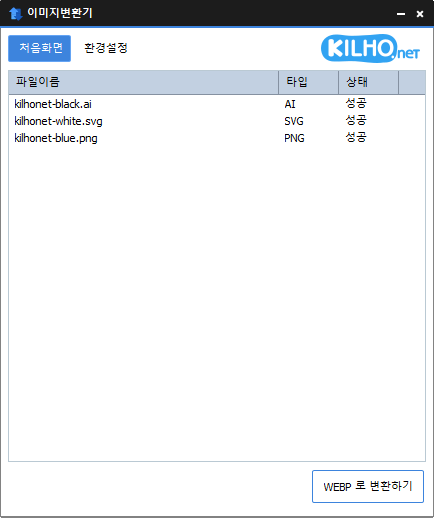

# 이미지변환기

**이미지 파일을 끌어다 놓고 버튼 한 번으로 JPG · PNG · GIF · WEBP · TIFF 로 바꿔 주는 Windows 무료 이미지 변환 프로그램.**

[English](README.md) · 한국어 · [简体中文](README.zh-CN.md) · [日本語](README.ja.md) · [Español](README.es.md) · [Português (Brasil)](README.pt-BR.md) · [Français](README.fr.md)

-0078D4)

## 개요

아이폰으로 찍은 HEIC 사진이 PC 에서 안 열릴 때, 블로그에 올릴 사진을 한꺼번에 줄여야 할 때, PDF 문서를 페이지별 그림으로 뽑아야 할 때 — 이미지변환기가 해결해 줍니다.

파일이나 폴더를 창에 끌어다 놓고 **변환하기** 버튼을 누르면 끝입니다. JPG 는 MozJPEG 으로 더 작게 저장하고, 크기를 지정하면 비율에 맞춰 줄이거나 늘립니다. 탐색기에서 파일을 마우스 오른쪽 버튼으로 눌러 바로 변환할 수도 있습니다.

변환 결과는 항상 **새 파일**로 저장됩니다. 원본 파일이나 이미 있는 파일은 절대 덮어쓰지 않습니다.

## 주요 기능

- **한 번에 여러 장** — 파일 여러 개, 폴더 통째로(하위 폴더까지) 목록에 넣고 한꺼번에 변환합니다.
- **5 가지 저장 형식** — JPG · PNG · GIF · WEBP · TIFF.
- **폭넓은 입력 형식** — JPG, PNG, GIF, BMP, WEBP, TIFF, HEIC, AVIF, PSD, PDF, SVG, TGA, ICO 등.
- **더 작은 JPG** — MozJPEG 으로 같은 화질을 더 작은 용량에 저장합니다.
- **비율 유지 크기 조정** — 가로 또는 세로 크기만 정하면 나머지는 비율에 맞춰집니다.
- **PDF → 이미지** — 여러 페이지 PDF 를 페이지마다 한 장씩 그림으로 저장합니다.
- **확장자가 없어도 인식** — 파일 이름이 아니라 파일 내용으로 형식을 알아냅니다.
- **원본 보호** — 같은 이름이 있으면 `사진 (1).jpg` 처럼 새 이름으로 저장합니다.
- **탐색기 우클릭 메뉴** — Windows 10 · 11 모두, Windows 11 기본 메뉴에도 나타납니다.
- **7 개 언어** — 한국어 · 영어 · 일본어 · 중국어 · 러시아어 · 이탈리아어 · 프랑스어. Windows 표시 언어를 따릅니다.

## 다운로드 / 설치

| 종류 | 링크 |
|---|---|
| 설치 파일 | [다운로드](https://down.kilho.net/imageconverter?lang=ko) |
| 무설치 (ZIP) | [다운로드](https://down.kilho.net/imageconverter?lang=ko&nosetup) |

설치 파일은 설치가 끝나면 이미지변환기를 바로 열고, 시작 메뉴와 탐색기 우클릭 메뉴를 등록합니다. 무설치판은 ZIP 을 풀고 `ImageConverter.exe` 를 실행하면 됩니다 — 이때 `vendor` 폴더를 실행 파일과 같은 곳에 두어야 합니다. **탐색기 우클릭 메뉴는 설치판에서 제공됩니다.**

## 사용법

### 처음 사용하기

1. 이미지변환기를 실행합니다. **처음화면** 에 빈 파일 목록이 보입니다.
2. 바꿀 이미지 파일이나 폴더를 목록으로 끌어다 놓습니다. 형식을 알아낸 파일만 들어가며, **타입** 열에 원본 형식이, **상태** 열에 `준비` 가 표시됩니다.
3. 아래 왼쪽의 크기 칸에서 **원본크기** · **가로크기** · **세로크기** 중 하나를 고릅니다. 가로·세로를 고르면 옆에 크기(px) 칸이 나타납니다.
4. 저장 형식을 확인합니다. 오른쪽 아래 버튼에 **JPG 로 변환하기** 처럼 지금 형식이 적혀 있습니다. 바꾸려면 버튼을 **마우스 오른쪽 버튼**으로 눌러 JPG · PNG · GIF · WEBP · TIFF 중에서 고릅니다.
5. 버튼을 누릅니다. 진행 막대가 나타나고 파일마다 상태가 `변환` → `성공` 으로 바뀝니다.
6. 변환된 파일은 기본적으로 **원본 파일과 같은 폴더**에 같은 이름, 새 확장자로 저장됩니다.

### 화면 구성

**처음화면**

| 요소 | 하는 일 |
|---|---|
| 파일 목록 | **파일이름** · **타입**(알아낸 원본 형식) · **상태**(`준비` / `변환` / `성공` / `실패`) |
| 목록 우클릭 | **선택된 목록 삭제** · **모든 목록 삭제** |
| 크기 선택 | **원본크기** · **가로크기** · **세로크기** |
| 크기 칸 | 자주 쓰는 크기를 목록에서 고르거나 숫자를 직접 입력 (가로·세로를 골랐을 때만 보임) |
| **JPG 로 변환하기** 버튼 | 누르면 변환 시작. 오른쪽 버튼으로 누르면 저장 형식 선택 |

**환경설정**

| 요소 | 하는 일 |
|---|---|
| **저장경로** | **원본 파일 폴더** 또는 지정 폴더(기본 `바탕 화면\ImageConverter`). `…` 버튼으로 폴더 변경 |
| **저장형식** | JPG · PNG · GIF · WEBP · TIFF (변환 버튼의 오른쪽 메뉴와 같은 설정) |
| **품질조정** | 40 ~ 100, 기본 75. 손실 압축 형식(JPG · WEBP)에 적용 |

### 이럴 때 이렇게

**아이폰 사진(HEIC)을 JPG 로 바꾸고 싶을 때**
HEIC 파일이나 사진이 든 폴더를 목록에 끌어다 놓고 형식을 **JPG** 로 두고 누릅니다. 휴대폰이 기록한 회전 정보에 맞춰 **바로 선 방향**으로 저장되므로, 옆으로 누운 사진을 따로 돌릴 필요가 없습니다.

**블로그·쇼핑몰에 올릴 사진 크기를 맞출 때**
크기 칸에서 **가로크기** 를 고르고 `1280` 처럼 원하는 너비를 고릅니다. 세로는 비율에 맞춰 저절로 정해져 사진이 찌그러지지 않습니다. 목록에 없는 값은 칸에 숫자를 바로 입력하면 됩니다(1 ~ 30000). 지정한 너비보다 작은 사진도 그 너비에 맞춰집니다.

**썸네일처럼 높이를 똑같이 맞출 때**
**세로크기** 를 고르면 모든 결과물의 높이가 같아지고 너비는 각자 비율대로 정해집니다. 가로 사진과 세로 사진이 섞여 있을 때 한 줄로 늘어놓기 좋습니다.

**용량을 줄여서 메일이나 메신저로 보낼 때**
형식을 **JPG** 로 두면 MozJPEG 으로 같은 화질을 더 작게 저장합니다. 더 줄이려면 **환경설정 → 품질조정** 을 60 정도로 낮추고, 크기도 **가로크기** 로 함께 줄이면 효과가 큽니다. **WEBP** 로 저장하면 보통 JPG 보다 더 작아집니다.

**투명 배경을 살리고 싶을 때**
투명 배경이 있는 PNG · SVG 등은 **PNG** 나 **WEBP** 로 저장하면 투명이 그대로 남습니다. JPG 는 투명을 담지 못하는 형식이니 로고나 아이콘에는 PNG · WEBP 를 고르세요.

**SVG 로고를 원하는 크기의 PNG 로 뽑을 때**
SVG 를 넣고 **가로크기** 를 `512` 처럼 지정한 뒤 **PNG** 로 변환합니다. 작은 그림을 늘리는 것이 아니라 **지정한 크기로 새로 그리기** 때문에 크게 뽑아도 선명합니다.

**PDF 를 페이지별 이미지로 만들 때**
PDF 를 넣고 변환하면 페이지마다 `문서-001.jpg`, `문서-002.jpg` … 처럼 번호가 붙은 파일로 저장됩니다. **원본크기** 면 화면에서 보는 크기로, **가로크기** 를 지정하면 그 너비에 맞춰 선명하게 그려 줍니다. 배경은 흰색입니다. 모든 페이지가 저장되면 상태가 `성공` 이 됩니다.

**움직이는 GIF 를 WEBP 로 바꿀 때**
저장 형식이 **GIF** 나 **WEBP** 면 움직이는 그림의 모든 장면을 그대로 옮깁니다. 움직이는 GIF 를 WEBP 로 바꾸면 움직임은 그대로, 용량은 줄어듭니다. JPG · PNG · TIFF 로 저장하면 첫 장면 한 장이 저장됩니다.

**화질 손실 없이 WEBP 로 저장하고 싶을 때**
**품질조정** 을 **100** 으로 올리면 WEBP 를 무손실로 저장합니다. 원본과 픽셀 하나까지 같게 보관하면서 PNG 보다 작게 만들고 싶을 때 씁니다.

**폴더 안의 이미지를 한꺼번에 바꿀 때**
폴더를 통째로 끌어다 놓으면 하위 폴더까지 모두 훑어 이미지 파일만 목록에 넣습니다. 문서나 동영상 같은 다른 파일은 저절로 빠지고, 같은 파일은 두 번 들어가지 않습니다.

**확장자가 없거나 잘못 붙은 파일일 때**
이미지변환기는 파일 이름이 아니라 **파일 내용**으로 형식을 알아냅니다. 확장자가 없는 파일, `.jpg` 인데 실제로는 PNG 인 파일도 제대로 인식하고, 결과물에는 올바른 확장자가 붙습니다.

**변환한 파일을 한 폴더에 모으고 싶을 때**
**환경설정 → 저장경로** 에서 아래쪽 폴더를 고르면 모든 결과물이 그 폴더에 모입니다. 기본값은 `바탕 화면\ImageConverter` 이고, 폴더가 없으면 변환할 때 만들어 줍니다. `…` 버튼으로 다른 폴더를 고를 수 있습니다. 원본 옆에 두고 싶으면 **원본 파일 폴더** 를 고릅니다.

**같은 이름의 파일이 이미 있을 때**
아무것도 덮어쓰지 않습니다. `사진.jpg` 가 있으면 `사진 (1).jpg`, `사진 (2).jpg` … 처럼 새 이름으로 저장합니다. JPG 를 다시 JPG 로 줄여도 원본은 그대로 남습니다.

**탐색기에서 바로 변환하고 싶을 때**
탐색기에서 이미지 파일을 하나 또는 여러 개 선택하고 마우스 오른쪽 버튼 → **이미지 변환** → **WebP 로 변환** · **PNG 로 변환** · **JPG 로 변환** 중 하나를 누릅니다. 그 파일들이 담긴 창이 열리면 크기를 고르고 버튼을 누르세요.
- 결과물은 **원본 파일과 같은 폴더**에 저장되고, 변환이 끝나면 창이 저절로 닫힙니다.
- 다른 파일을 또 우클릭해 변환하면 창이 따로 열려 동시에 진행할 수 있습니다.
- 메뉴는 JPG · PNG · GIF · BMP · WEBP · TIFF · HEIC · AVIF · PSD · PDF · SVG · TGA 파일을 골랐을 때 나타납니다.

**같은 사진을 여러 형식으로 만들 때**
변환이 끝나도 목록은 그대로 남습니다. 버튼을 오른쪽 버튼으로 눌러 형식을 바꾸고 다시 누르면, 같은 파일들을 다른 형식으로 한 번 더 만들 수 있습니다.

**목록을 정리할 때**
빼고 싶은 줄을 고르고(`Ctrl` · `Shift` 로 여러 줄) 목록을 마우스 오른쪽 버튼으로 눌러 **선택된 목록 삭제** 를 누릅니다. 다 비우려면 **모든 목록 삭제** 입니다. 목록에서만 빠지고 실제 파일은 지워지지 않습니다.

**변환 도중에 그만두고 싶을 때**
창을 닫으면 **변환을 중단하고 종료할까요?** 라고 묻습니다. **예** 를 누르면 지금 처리 중인 파일까지만 마치고 종료합니다. 이미 저장된 결과물은 그대로 남습니다.

## 설정

**환경설정** 에서 바꾼 값과 처음화면의 크기 선택은 저절로 기억되어 다음 실행에도 이어집니다.

| 항목 | 기본값 |
|---|---|
| 저장형식 | JPG |
| 크기 | 원본크기 (가로크기 640 / 세로크기 540) |
| 품질조정 | 75 |
| 저장경로 | 원본 파일 폴더 (지정 폴더 기본값: `바탕 화면\ImageConverter`) |
| 언어 | Windows 표시 언어 (지원하지 않는 언어면 영어) |

## 요구 사항

- Windows 10 · Windows 11 (64비트)
- 변환에 필요한 도구가 모두 함께 들어 있어 따로 설치할 것이 없습니다. 프로그램 실행에 관리자 권한이 필요 없습니다.
- 인터넷 연결은 새 버전 안내에만 쓰입니다. 변환은 모두 PC 안에서 이루어집니다.

## 업데이트

이미지변환기는 스스로 업데이트하지 **않습니다**. 실행할 때 새 버전이 있는지 확인해 안내 창을 띄우고, **[예]** 를 누르면 다운로드 페이지를 열고 프로그램을 종료합니다. 새 버전은 내부 검증을 거쳐 수동으로 배포되며 [이미지변환기 페이지](https://kilho.net/imageconverter)에 공지됩니다. [업데이트 정책 안내](https://kilho.net/archives/notice/2940)를 참고하세요.

**버전 이력**

| 버전 | 날짜 | 내용 |
|---|---|---|
| 2.0.0 | 2026-09-22 | 새로워진 화면, 크기를 목록에서 고르거나 직접 입력, 업데이트 뒤에도 기존 설정 그대로 사용, 탐색기 우클릭 변환 개선 |
| 1.6.3 | 2026-09-03 | Windows 11 우클릭 메뉴에서 더 빠르게 변환, 업데이트 설치 과정 개선, PDF 변환을 더 선명하게·큰 문서 안정성 강화, HEIC · AVIF 인식 향상, 빈 파일을 목록에서 미리 거름 |
| 1.6.2 | 2026-08-17 | PDF 변환 엔진 개선으로 품질 향상, 변환 중에도 안전하게 종료, 기존 파일 보호 강화, 특수문자가 든 파일 이름 지원 개선, 파일 목록 성능 개선 |
| 1.6.1 | 2026-07-16 | JPG · 여러 페이지 PDF 변환 안정성 향상, HEIC 등 형식 인식 개선, 탐색기 우클릭 메뉴와 환경설정 사용성 개선 |

## 라이선스

이미지변환기는 **프리웨어**입니다. 회사, 집, 관공서, 학교 등 어디서나 제약 없이 무료로 사용할 수 있고, 자유롭게 재배포할 수 있습니다.

## 링크

- 웹사이트: <https://kilho.net/imageconverter>
- 포럼: <https://groups.google.com/g/kilhonet>
- X (Twitter): <https://www.twitter.com/kilhonet>

© KILHO.NET
